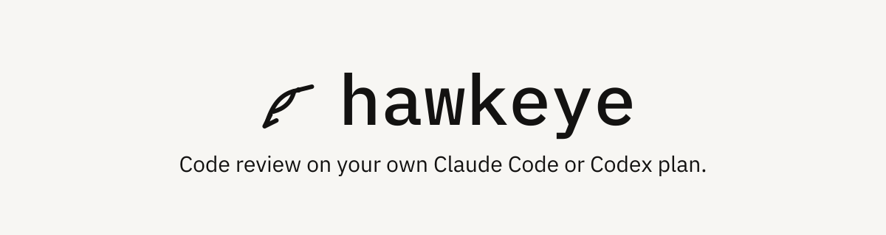

<picture>
  <source srcset=".github/banner-dark.svg" media="(prefers-color-scheme: dark)">
  <source srcset=".github/banner-light.svg" media="(prefers-color-scheme: light)">
  
</picture>

<br>

Open a pull request. A runner on your machine reads every push with the coding agent you already pay for, under your own login, and posts one verdict as `hawkeye-review[bot]`. No token bill, no credentials in the cloud, and silence where the code is fine.

[Sign in with GitHub](https://hawkeye-review.vercel.app) to review every push, or try one review with no account:

```sh
npx hawkeye-review prepare https://github.com/owner/repo/pull/123
```

## A real review

The first round on this repository's own [pull request #87](https://github.com/ShobhitPatra/hawkeye/pull/87) is a review the bot posted: a verdict, one line per finding with the file and line, the lenses behind a disclosure, and the round in the footer. The [landing page](https://hawkeye-review.vercel.app) replays it from open to posted.

## What happens when you open a pull request

1. **Every push queues one job for its head.** Pushes collapse to the latest head, so a busy branch never piles up reviews. The hosted control plane holds only the queue, webhooks and findings.
2. **Your runner claims it and clones the branch.** One process on hardware you own. The control plane never sees a plan credential and never proxies model traffic.
3. **Your coding agent reviews it under your login.** Six lenses, four severities, one verdict. Only validated findings JSON leaves the machine.
4. **The comment lands as `hawkeye-review[bot]`.** A comment, never a block. On the next push, addressed findings resolve and only new ones are raised.

## What it costs

Nothing beyond the plan you already pay for. Your plan's limits are the budget, and the dashboard shows what each review cost in turns and minutes.

## Start with one pull request

1. Sign in with GitHub at [hawkeye-review.vercel.app](https://hawkeye-review.vercel.app) and install the GitHub App on a repository you admin.
2. On the machine where your coding agent is logged in, connect a runner and leave it running:

   ```sh
   npx hawkeye-review runner login --url https://hawkeye-review.vercel.app
   npx hawkeye-review runner
   ```

3. On the dashboard, turn on reviews for a pull request. From then on every push to it starts a review at once, and the comment is updated in place; a push during a review stops it and starts the next.

The hosted instance shows every repository where the App is installed and your GitHub account has access. Claude Code works today; Codex support is the next release.

## Try one review with no account

`npx hawkeye-review prepare <pr-url>` fetches the pull request and writes the review prompt into a round directory. Open the prompt in any coding agent session, let it review the checkout, then run the `show` command it printed to read the verdict. Nothing is posted anywhere. It needs Node 22, git, and a GitHub token (`gh auth token` is enough).

## Open source, yours to run

- MIT licensed, and every pull request to this repository is reviewed by Hawkeye itself before a maintainer reads it.
- Run your own instance: the [self-hosting guide](docs/self-hosting.md) covers a Vercel deployment on Neon Postgres, or a single machine with Docker Compose.
- Read [how it works and why](docs/design.md), the [contributing guide](CONTRIBUTING.md), and the [security policy](SECURITY.md).
